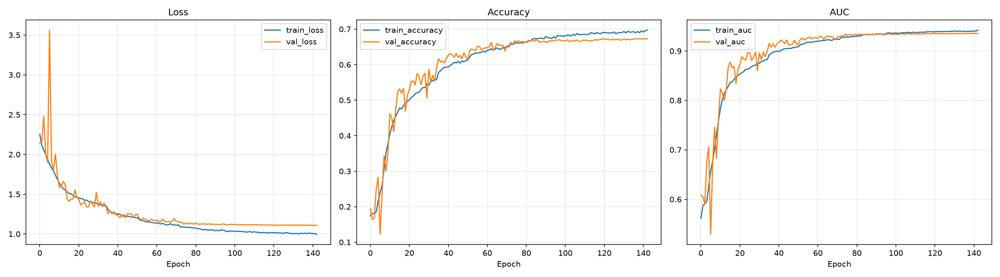
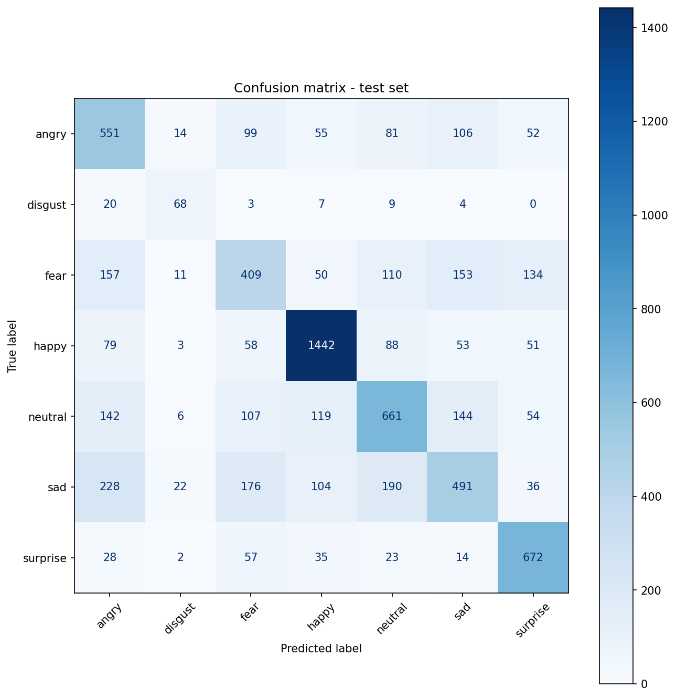
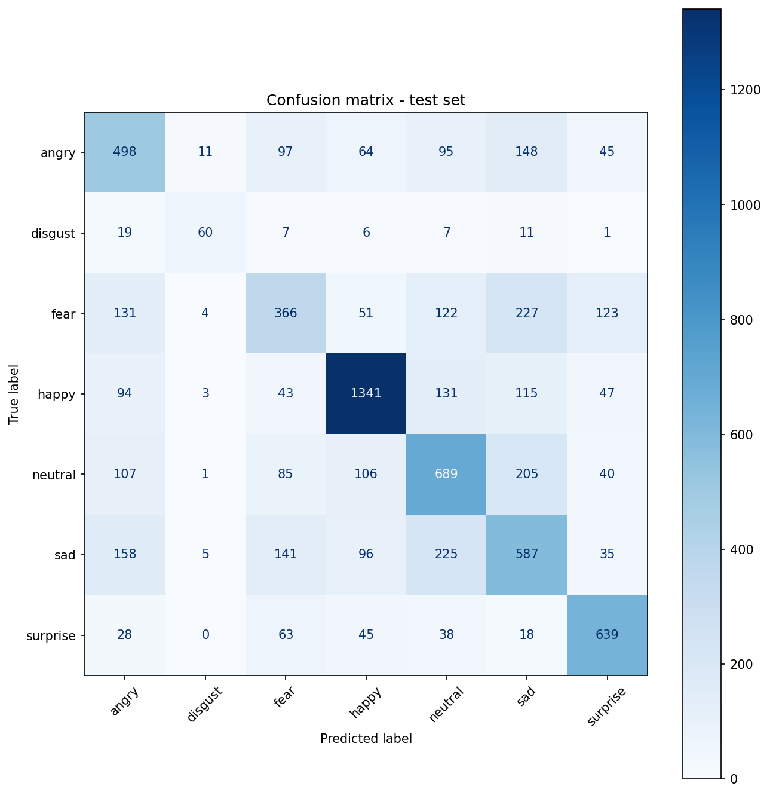

# FaceFERward

FaceFERward e' un progetto sperimentale di Deep Learning per il riconoscimento automatico delle emozioni facciali su immagini del dataset FER-2013. Il progetto confronta diverse architetture di classificazione, con attenzione sia alle prestazioni sia alla leggibilita' degli errori prodotti dai modelli.

Il dataset contiene immagini di volti in scala di grigi, organizzate in sette classi:

- `angry`
- `disgust`
- `fear`
- `happy`
- `neutral`
- `sad`
- `surprise`

Dataset utilizzato: FER-2013, disponibile su Kaggle all'indirizzo <https://www.kaggle.com/datasets/msambare/fer2013>.

Esperimenti eseguiti presenti in:  
<https://unicadrsi-my.sharepoint.com/:f:/g/personal/m_antelmi_studenti_unica_it/IgCq0or6HYDSTqS5xZFTDUdXAQFbA0Ff1WpJgmkj9lRPeto?e=zTSJFO>

Scaricare le cartelle e inserirle in:
```text
ProgettoDL_FaceFERward/
|-- experiments/ <--
```

## Obiettivi del progetto

Il progetto parte da tre domande di ricerca:

1. **Quale architettura offre il miglior compromesso tra accuratezza e costo computazionale?**  
   Sono stati confrontati modelli CNN custom, una CNN piu' profonda, MobileNetV2 e ResNet50 in transfer learning. Il confronto usa accuracy, AUC, F1-score, tempo di inferenza e complessita' del modello.

2. **Il modello usa aree del volto coerenti con il riconoscimento dell'espressione?**  
   Sono state prodotte visualizzazioni Grad-CAM per osservare se l'attenzione del modello ricade su regioni significative del volto.

3. **Quali emozioni risultano piu' difficili da classificare?**  
   Le confusion matrix e i classification report sono stati usati per individuare le classi piu' soggette a errore, con particolare attenzione a `fear`, `sad` e alle classi meno rappresentate.

## Struttura del repository

La struttura segue le linee guida del progetto sperimentale, separando dati, notebook, esperimenti e risultati.

```text
ProgettoDL_FaceFERward/
|-- assets/
|   |-- images/
|   |-- slides/
|   |-- video/
|-- data/
|   |-- original/
|   |   |-- train/
|   |   |-- test/
|   |-- processed/
|       |-- train/
|       |-- validation/
|-- experiments/
|   |-- YYYY-MM-DD/
|       |-- <timestamp>_<model_name>/
|-- notebooks/
|-- results/
|   |-- YYYY-MM-DD/
|   |   |-- <timestamp>_<model_name>/
|   |       |-- figures/
|   |       |-- tables/
|   |       |-- predictions/
|   |-- models_comparison.csv
|   |-- preprocessing_split_counts.csv
|-- README.md
|-- requirements.txt
```

La cartella `experiments/` contiene i file necessari a riprodurre o ispezionare le run: configurazioni, modelli salvati, history e log. La cartella `results/` contiene invece solo output pensati per analisi e documentazione: figure, tabelle e predizioni. I file globali che fanno riferimento a tutti i modelli e train svolti `models_comparison.csv` e `preprocessing_split_counts.csv` restano direttamente in `results/`.

## Dataset e preprocessing

Il dataset originale viene mantenuto in `data/original/`, senza modificare direttamente le immagini sorgenti. Il notebook di preprocessing genera uno split pronto per il training in `data/processed/`.

Conteggi usati negli esperimenti:

| Classe | Train | Validation | Test |
|---|---:|---:|---:|
| angry | 4507 | 799 | 958 |
| disgust | 477 | 87 | 111 |
| fear | 4588 | 819 | 1024 |
| happy | 8062 | 1443 | 1774 |
| neutral | 5560 | 993 | 1233 |
| sad | 5407 | 966 | 1247 |
| surprise | 3554 | 634 | 831 |

Il preprocessing applica normalizzazione e preparazione delle immagini per il training, mantenendo il test set separato. Questo riduce il rischio di data leakage: il test set viene usato solo nella valutazione finale.

## Notebook principali

I notebook sono organizzati per fase sperimentale:

| Notebook | Ruolo |
|---|---|
| `notebooks/Preprocessing.ipynb` | prepara `data/processed/train` e `data/processed/validation`, e salva i conteggi in `results/preprocessing_split_counts.csv` |
| `notebooks/Training.ipynb` | addestra CNN custom leggere, incluse varianti `cnn_v2`, `cnn_v3`, `cnn_v4` |
| `notebooks/Training_CNN_Complex.ipynb` | addestra una CNN custom piu' profonda |
| `notebooks/Training_MobileNetV2.ipynb` | esegue transfer learning con MobileNetV2 |
| `notebooks/Training_ResNet.ipynb` | esegue transfer learning con ResNet50 |
| `notebooks/Evaluation.ipynb` | valuta un modello salvato e genera report, confusion matrix, predizioni e Grad-CAM |
| `notebooks/Training_unificato.ipynb` | raccoglie parti sperimentali in un flusso unico, utile come riferimento storico/operativo |

Ordine consigliato di esecuzione:

1. `notebooks/Preprocessing.ipynb`
2. un notebook di training tra quelli disponibili
3. `notebooks/Evaluation.ipynb`, impostando `EXPERIMENT_NAME` con il nome della run da valutare

Esempio:

```python
EXPERIMENT_NAME = "20260629_185100_cnn_complex_v1"
```

## Modelli testati

Sono state valutate piu' famiglie di modelli:

- **CNN custom baseline**, usata come primo riferimento sperimentale.
- **CNN custom v2/v3/v4**, varianti leggere con differenze architetturali e di configurazione.
- **CNN complex**, rete custom piu' profonda, con piu' blocchi convoluzionali e maggiore capacita' rappresentativa.
- **MobileNetV2 transfer**, modello preaddestrato su ImageNet e adattato al task FER-2013.
- **ResNet50 transfer**, ulteriore confronto con architettura preaddestrata piu' profonda.

Le run principali sono sintetizzate in `results/models_comparison.csv`.

## Risultati principali

La migliore run ottenuta e' `20260707_163656_cnn_complex_v1`, con accuracy sul test set pari a **0.6144** e macro F1 pari a **0.59**.

| Run | Modello | Accuracy | Macro F1 | Weighted F1 | AUC | Inference |
|---|---|---:|---:|---:|---:|---:|
| `20260707_163656_cnn_complex_v1` | CNN complex | 0.6144 | 0.59 | 0.61 | 0.9078 | 2.28 ms/img |
| `20260630_135725_ResNet50_transfer` | ResNet50 transfer | 0.6076 | 0.5975 | 0.6070 | 0.9017 | 25.23 ms/img |
| `20260705_190109_mobilenetv2_transfer` | MobileNetV2 transfer | 0.5823 | 0.5733 | 0.5807 | 0.8907 | 1.46 ms/img |
| `20260628_120337_cnn_v1` | CNN baseline | 0.5705 | 0.5246 | 0.5601 | 0.8918 | n.d. |
| `20260706_172701_cnn_v2` | CNN v2 | 0.5414 | 0.5027 | 0.5291 | 0.8745 | n.d. |
| `20260706_233427_cnn_v4` | CNN v4 | 0.5315 | 0.4834 | 0.5206 | 0.8716 | n.d. |

La CNN complex e' risultata il modello piu' efficace tra quelli testati. ResNet50 ha ottenuto buone prestazioni, ma con un tempo di inferenza piu' alto. MobileNetV2 e' piu' leggera e veloce, ma in questa configurazione non supera la CNN complex. Le CNN leggere restano utili come baseline e per analizzare il compromesso tra semplicita' e prestazioni.

## Figure significative

Le figure seguenti sono una selezione ridotta degli output prodotti. Tutte le altre curve, matrici, tabelle e predizioni sono disponibili nella cartella `results/`.

### CNN complex - curve di training



### CNN complex - confusion matrix


### ResNet50 transfer - confusion matrix



### MobileNetV2 transfer - confusion matrix



## Analisi degli errori

La CNN complex migliora in modo evidente rispetto alla baseline, ma non risolve completamente le ambiguita' del dataset. Le classi piu' riconoscibili sono `happy` e `surprise`, mentre `fear` resta una delle classi piu' difficili. Questo e' coerente con la natura di FER-2013: immagini piccole, grayscale, rumorose e con espressioni talvolta visivamente simili.

Nel modello migliore:

- `happy` raggiunge F1-score circa 0.83;
- `surprise` raggiunge F1-score circa 0.76;
- `fear` rimane piu' debole, con F1-score circa 0.35;
- `sad` e `neutral` presentano confusione reciproca;
- `disgust` ha pochi esempi nel test set, quindi va interpretata con cautela anche quando il valore F1 e' buono.

Questa analisi e' importante anche in ottica responsible deep learning: un classificatore di emozioni facciali non deve essere interpretato come sistema infallibile, soprattutto in classi sottili o sbilanciate. Le predizioni vanno considerate come supporto sperimentale e non come decisione affidabile in contesti sensibili.

## Grad-CAM e interpretabilita'

Per valutare in modo qualitativo il comportamento dei modelli, `Evaluation.ipynb` include una sezione Grad-CAM. L'obiettivo e' verificare se il modello concentra l'attenzione su regioni del volto plausibili per il riconoscimento dell'espressione.

Le visualizzazioni Grad-CAM vengono salvate in:

```text
gradcam_results/
```

Questa analisi non sostituisce le metriche quantitative, ma aiuta a discutere limiti, casi di errore e affidabilita' del modello.

## Come riprodurre il progetto

Creare un ambiente Python e installare le dipendenze:

```bash
pip install -r requirements.txt
```

Eseguire poi i notebook nell'ordine:

```text
notebooks/Preprocessing.ipynb
notebooks/Training_CNN_Complex.ipynb
notebooks/Evaluation.ipynb
```

Per provare altre architetture, sostituire il notebook di training con:

```text
notebooks/Training.ipynb
notebooks/Training_MobileNetV2.ipynb
notebooks/Training_ResNet.ipynb
```

Ogni nuova run viene salvata automaticamente secondo la struttura:

```text
experiments/YYYY-MM-DD/<timestamp>_<model_name>/
results/YYYY-MM-DD/<timestamp>_<model_name>/
```

## File prodotti da una run

Una run completa salva tipicamente:

```text
experiments/YYYY-MM-DD/<run>/
|-- config.json
|-- model.keras
|-- training_history.csv
|-- training_log.txt
|-- test_results.txt
```

e:

```text
results/YYYY-MM-DD/<run>/
|-- figures/
|   |-- <run>_training_curves.png
|   |-- <run>_confusion_matrix.png
|-- tables/
|   |-- <run>_classification_report.csv
|   |-- <run>_confusion_matrix.csv
|-- predictions/
    |-- <run>_test_predictions.csv
```

Le predizioni sono utili per analisi successive, ma non sono obbligatorie per ogni run storica.

## Conclusioni

Il progetto mostra che una CNN custom piu' profonda puo' superare sia la baseline sia i modelli preaddestrati testati, almeno nella configurazione sperimentale adottata. Il miglior risultato e' stato ottenuto dalla CNN complex, con accuracy pari a 0.6144 e AUC pari a 0.9078 sul test set.

Il confronto conferma inoltre che il transfer learning da ImageNet non garantisce automaticamente prestazioni migliori su FER-2013: il dominio di partenza e' diverso, mentre il dataset finale e' composto da volti grayscale a bassa risoluzione. Le analisi per classe e Grad-CAM evidenziano infine che il riconoscimento delle emozioni resta un task delicato, con errori piu' frequenti sulle classi visivamente ambigue.
